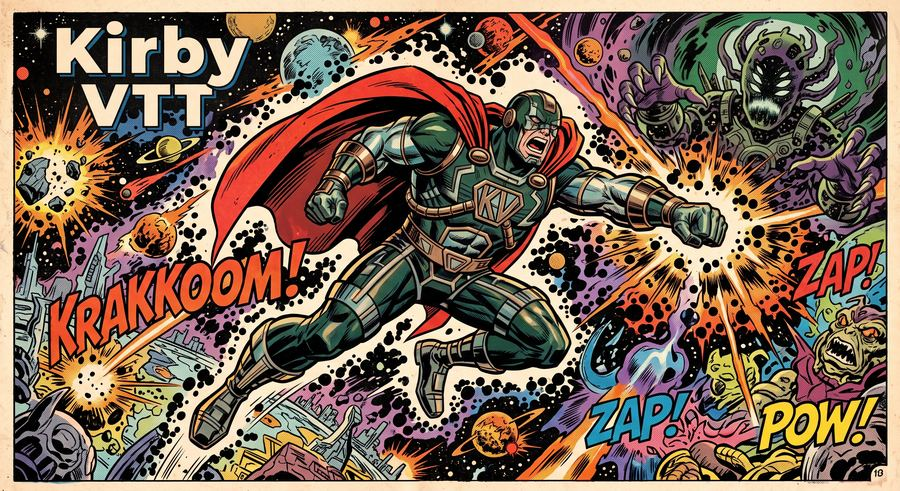

  

# kirby-sheet

Render a HERO Designer character through HD's own `.hde` export templates —
byte for byte.

Hero Designer has no plain-text exporter. `HTMLWriter` is the only writer it
has, and it substitutes `<!--TOKEN-->` markers into an export template. This
reproduces that, so a sheet rendered here is the sheet HD would have rendered.

**Status: the output engine.** Reads a `.hdc` character through
[kirby-cost](https://github.com/pdbethke/kirby-cost) and writes it out as
JSON, plain text, HTML, PDF, or back to `.hdc`. It also inspects `.hde`
templates, reporting which tokens a template uses and which the renderer
resolves.

The `.hde` template engine is gated byte-for-byte against HD itself.

## Ships no Hero Games content

No templates, no rules text, no character files. Point it at a `.hde` you
already have.

## Development

    python -m venv venv && source venv/bin/activate
    pip install -e ../kirby-cost          # ALWAYS, and first
    pip install -e ".[dev]"
    python -m pytest tests/ -q

**Install the sibling editable, and do it first.** `kirby-cost` is published,
so `pip` will happily resolve the dependency pin against PyPI and give you a
release that is behind the checkout next door — same version number, different
code. That is not a hypothetical: this package was built for a day against a
stale 0.2.2 and read a character's STR as 5 instead of 15 before anyone
noticed. Nothing fails loudly when it happens, because a stale dependency
installs perfectly.

Tests that need Hero Designer skip when it is absent:

| Variable | What it names |
|---|---|
| `KIRBY_SHEET_HDC` | a `.hdc` character |
| `KIRBY_SHEET_ORACLE` | a headless Hero Designer CLI to compare against |

The oracle is a harness around licensed Hero Designer source and is not
distributable, so the tests that use it skip for everyone but the maintainer.
The rest of the suite runs on a clean checkout.

## Where this is going

This is one of three engines behind [Kirby](https://kirbyvtt.org), a virtual
tabletop for the HERO System in active development:

- **[kirby-cost](https://github.com/pdbethke/kirby-cost)** — reads a HERO 6E
  build and costs it, validated against Hero Designer
- **[kirby-sheet](https://github.com/pdbethke/kirby-sheet)** — renders a
  character to JSON, text, HTML, PDF, or back to `.hdc`
- **[kirby-combat](https://github.com/pdbethke/kirby-combat)** — the combat
  engine: attacks, movement, mental combat, vehicles, mass combat,
  destructible terrain

What's still to come is the table itself — terrain with its own PD and ED,
elevation and concealment that move OCV and DCV, and line of sight worked out
from where a character is actually standing. Kirby plays characters; it does
not create them. Character creation stays in Hero Designer.

Progress and notes at [kirbyvtt.org](https://kirbyvtt.org).

## Provenance

**This is a port of licensed source code, purchased from Hero Games** — the
same provenance as [kirby-cost](https://github.com/pdbethke/kirby-cost), whose
README sets it out in full.

The **HERO Designer Source Code** package is an official product Hero Games
sells, offered precisely so people can build software that works with HD. The
`HTMLWriter` behaviour reproduced here is cited against it line by line
throughout this repository (e.g. `HTMLWriter.swapValue` (HTMLWriter.java:5636)).
The purchase receipt and product page are retained by the maintainer and are
deliberately not in this repository, which carries no Hero Games material of
any kind.

### Licence terms, and how this project sits inside them

Quoted from the product page:

> - You are welcome to change the code or utilize it however you want for your own personal use.
> - If the product you develop is distributed, you will need to pursue licensing with HERO Games -- the terms are exceedingly easy.
> - If the product you develop is intended for sale, there may be a licensing discussion needed with both HERO Games and the developer/owner of the HERO Designer source code. Generally speaking, use of the HERO Designer source code which does not replace or replicate the character generation process does not fall into this category.

**This project follows those guidelines deliberately.**

- The source licence was **purchased**, at full price, from Hero Games' own store.
- Use here is **personal**, which the first condition permits without conditions.
- kirby-sheet **does not replace or replicate the character generation
  process**. It has no creation interface. It renders and re-expresses a
  character HD already built, and it cannot run without a `.hde` template and
  a `.hdc` file that only HD produces.
- It is **noncommercial** — offered under PolyForm Noncommercial 1.0.0, not
  for sale — so the third condition's "intended for sale" case is not engaged.
- **The second condition is acknowledged, not hidden.** This repository is
  public, which the terms treat as distribution. Nothing of Hero Games' is
  redistributed — not the templates, not the character files, not the rules
  text. Hero Games describe the licensing terms as "exceedingly easy", and if
  they want that arrangement formalised, contact the maintainer.

If Hero Games, or the owner of the HERO Designer source, sees any of this
differently, we want to hear it — contact the maintainer and it will be acted
on.

### Copyright and trademark

HERO Designer is © 2002, 2003, 2006, 2009 by DOJ, Inc. d/b/a Hero Games.
**HERO System™** is DOJ, Inc.'s trademark for its roleplaying system. Game
rules content remains the property of its copyright holders, and no claim is
made to ownership of the HERO Designer application, the game rules, or the
game mechanics. This project is an independent work and is not affiliated with
or endorsed by DOJ, Inc. d/b/a Hero Games.

## Licence

See [`LICENSE`](LICENSE) for the terms this code is offered under
(PolyForm Noncommercial 1.0.0).
